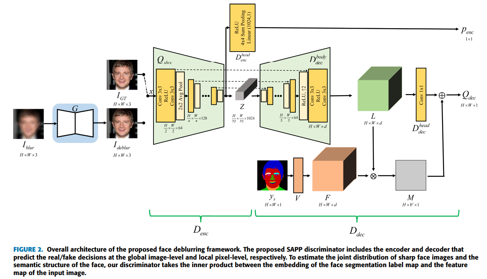
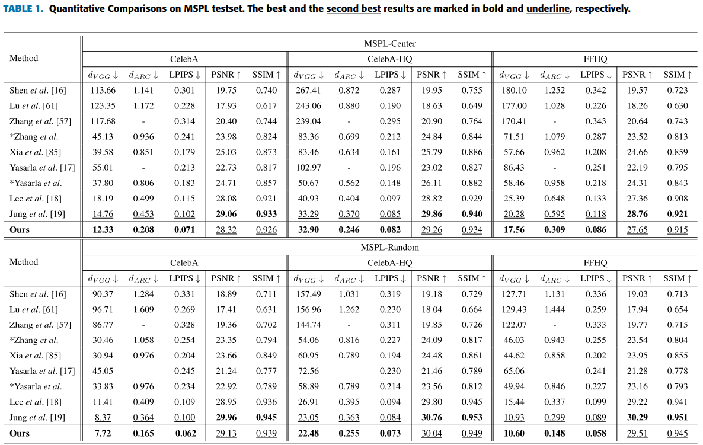
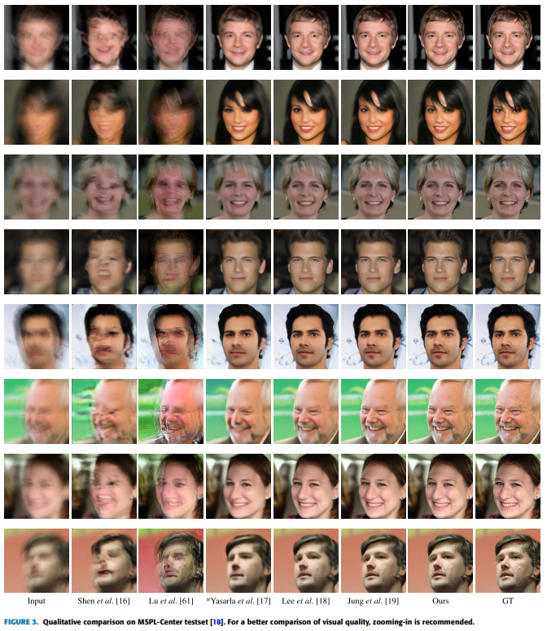
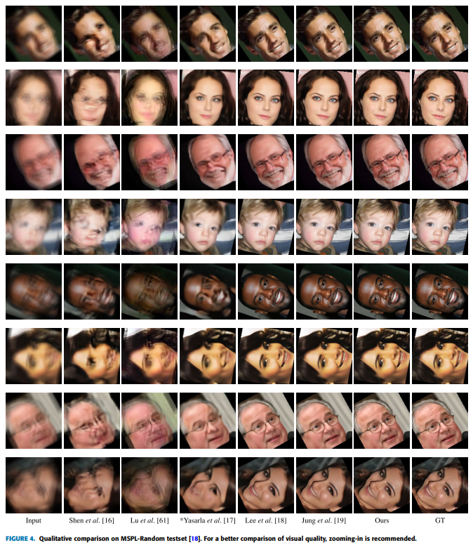
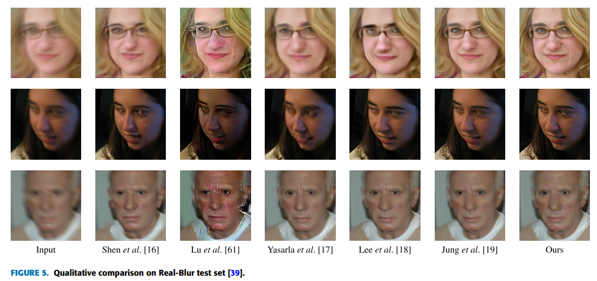

# SAPPGAN

Pytorch implementation of "Semantic-Aware Face Deblurring with Pixel-Wise Projection Discriminator", IEEE Access, 2023

[paper](https://ieeexplore.ieee.org/stamp/stamp.jsp?arnumber=10036438)

## Overview


## Requirements
+ Python 3.7
+ PyTorch == 1.8.1
+ numpy
+ torchvision
+ PIL
+ scipy
+ tqdm


## Train
### 1. Prepare training data
1.1 Download the [MSPL](https://github.com/dolphin0104/MSPL-GAN#2-training) dataset.

1.2 Download the [VGGFace16](https://github.com/ustclby/Unsupervised-Domain-Specific-Deblurring) model weight to `./test/`

1.3 Specify `./utils/parser.py`:
```python
parser.add_argument("--celebahq_folder", type=str, default="path / to / your / CelebAHQ / dataset ")
parser.add_argument("--valid_folder", type=str, default="path / to / your / validation / dataset ")
parser.add_argument("--kernel_path", type=str, default="path / to / your / training / kernels")

parser.add_argument("--VGGFace16", type=str, default='path/to/VGGFace16.pth')

```


### 2. Begin to train
Run this command:

`python train.py`


## Test
### 1. Prepare test data
Follow [MSPLGAN](https://github.com/dolphin0104/MSPL-GAN#3-test) to prepare test dataset.


### 2. Begin to test
Run this command:

`python test.py`


## Comparative Results
### Quantitative Comparisons on MSPL test set


### Qualitative Comparisons on MSPL-Center test set


### Qualitative Comparisons on MSPL-Random test set


### Real Blur



## Citation
```
@article{sujy2023semantic,
  title={Semantic-Aware Face Deblurring with Pixel-Wise Projection Discriminator},
  author={Sujy, HAN and Lee, Tae Bok and Heo, Yong Seok},
  journal={IEEE Access},
  year={2023},
  publisher={IEEE}
}
```

## Acknowledgements
This code is built on [U-Net GAN](https://github.com/boschresearch/unetgan) and [MSPLGAN](https://github.com/dolphin0104/MSPL-GAN). We thank the authors for sharing the codes.
